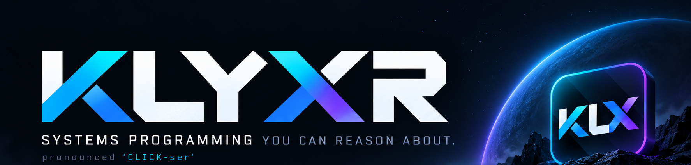
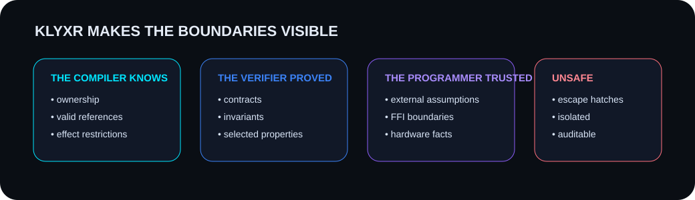
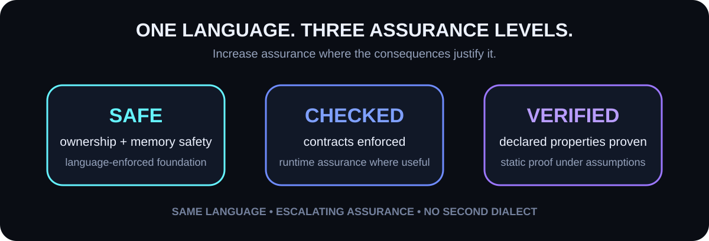

<p align="center">
  
</p>

<p align="center">
  <a href="https://github.com/gregkrsak/klyxr/actions/workflows/build.yml"></a>
  <a href="https://github.com/gregkrsak/klyxr/actions/workflows/tests.yml"></a>
  <a href="https://github.com/gregkrsak/klyxr/actions/workflows/verify.yml"></a>
  <a href="https://github.com/gregkrsak/klyxr/actions/workflows/docs.yml"></a>
</p>

<p align="center">
  <strong>Ownership · Contracts · Effects · Verification</strong>
</p>

<p align="center">
  <a href="#why-klyxr">Why Klyxr?</a> ·
  <a href="#a-quick-taste">Quick taste</a> ·
  <a href="#safe--checked--verified">Assurance model</a> ·
  <a href="#how-is-klyxr-different-from-rust">vs. Rust</a> ·
  <a href="#how-is-klyxr-different-from-adaspark">vs. Ada/SPARK</a> ·
  <a href="#status">Status</a>
</p>

---

# Klyxr

> **Systems programming you can reason about.**  
> Pronounced **“CLICK-ser.”**

**Klyxr** is a systems programming language in development that combines
**ownership-based memory safety**, **first-class contracts**, **explicit effects**,
**domain-aware types**, and **incremental formal verification**.

It starts from a simple premise:

> **Memory safety is the beginning of the argument, not the end.**

Modern systems languages have shown that major classes of bugs can be moved from runtime into the language model.
Klyxr asks the next question:

> **What other engineering truths should be part of the program itself — visible to the compiler, checkable by tools, and auditable by humans?**

---

## Why Klyxr?

Systems code depends on more than valid pointers.

Real software also has rules like:

```text
this percentage must remain between 0 and 100

this control loop may not allocate

this task must not block

this operation may occur only in the ARMED state

this function must preserve the invariant

this assumption is trusted rather than proven
```

Today those truths often live in comments, tests, wrapper types, runtime checks, coding standards, review checklists, or the heads of experienced engineers.

**Klyxr wants more of them in the language.**

<p align="center">
  
</p>

The goal is not magical correctness.

The goal is **engineering clarity**:

- what the compiler knows,
- what the verifier proved,
- what the programmer assumed,
- and where the guarantees stop.

---

## A quick taste

### Constrain the domain

```text
type Percent = range 0..100;

record Battery {
    charge: Percent
}
```

No convention. No “remember this value is a percentage.”

The type says what values may exist.

### State the contract

```text
verified fn consume(
    battery: &mut Battery,
    amount: Percent
)
    requires amount <= battery.charge
    ensures battery.charge == old(battery.charge) - amount
{
    battery.charge -= amount;
}
```

Now consider:

```text
let mut battery = Battery { charge: 80 };

consume(&mut battery, 90);
```

Nothing here is memory-unsafe.

But it is still wrong.

A Klyxr verifier should be able to explain **why**:

```text
error: precondition cannot be established

  --> src/battery.klx:14:1

14 | consume(&mut battery, 90);
   | ^^^^^^^^^^^^^^^^^^^^^^^^^

required:
    amount <= battery.charge

known:
    amount == 90
    battery.charge == 80

90 <= 80 is false
```

That distinction is central to Klyxr:

> **Memory-safe does not automatically mean application-correct.**

---

## Effects are part of the API

Some rules are operational rather than mathematical.

```text
#[deny_effects(heap, blocking)]
fn control_loop(...)
    effects clock
{
    estimate_state(...);
}
```

If a transitive dependency allocates:

```text
error: forbidden effect `heap`

control_loop
└── estimate_state
    └── resize_buffer
        ^ introduces effect `heap`
```

The control loop did not merely *document* that allocation was forbidden.

It made the rule **compiler-visible**.

---

## Safe → Checked → Verified

<p align="center">
  
</p>

Klyxr is designed around **one language with escalating assurance**.

### `safe`

Ordinary Klyxr code gets the language's core guarantees:

- ownership and borrowing,
- initialization safety,
- reference validity,
- bounded memory access,
- race restrictions,
- deterministic destruction.

### `checked`

Additional constraints and contracts may be enforced dynamically.

```text
checked fn withdraw(...)
    requires amount <= balance
```

### `verified`

Declared properties become proof obligations.

```text
verified fn withdraw(...)
    requires amount <= balance
    ensures balance == old(balance) - amount
```

> **Verification is not a second language you graduate into.  
> It is an assurance level you apply where it earns its cost.**

---

## Own what moves. Constrain what exists. Prove what matters.

Klyxr's design philosophy is intentionally compact.

### **Own what moves**
Ownership and borrowing make memory and mutation rules structural.

### **Constrain what exists**
Range types, units, invariants, and contracts express the domain directly.

### **Prove what matters**
Formal verification is available where consequences justify it.

### **Make every escape hatch visible**
Allocation, blocking, I/O, trusted assumptions, FFI, and `unsafe` boundaries should be easy to find and audit.

---

## How is Klyxr different from Rust?

Rust proved that systems programmers do not have to choose between
**low-level control** and **strong memory safety**.

Klyxr takes that lesson seriously.

> **Rust reasons deeply about ownership.  
> Klyxr aims to extend that style of reasoning to contracts, domain constraints, effects, trust boundaries, and selected program properties.**

Many of those capabilities can be built around Rust through types, libraries, conventions, and verification tools.

Klyxr's goal is different:

**design them as one coherent language model from the beginning.**

| | Rust | Klyxr |
|---|---|---|
| Ownership / borrowing | Core | Core |
| Memory safety without GC | ✅ | ✅ |
| Algebraic enums / matching | ✅ | ✅ |
| Range/domain types | Usually modeled | First-class design goal |
| Preconditions / postconditions | External patterns/tools | First-class |
| Explicit effects | Mostly encoded indirectly | First-class design goal |
| Formal verification | Specialized toolchains | Integrated workflow |
| Assurance progression | Not language-level | `safe → checked → verified` |
| Trust audit | Tool/project dependent | Explicit design goal |

---

## How is Klyxr different from Ada/SPARK?

Ada/SPARK demonstrated that **contracts, constrained types, static analysis, and proof can be practical engineering tools**.

Klyxr draws deeply from that tradition — but uses a different programming model.

> **SPARK brings formal methods to Ada.  
> Klyxr is designed to make provable systems programming feel native to the ownership generation.**

Klyxr combines the assurance mindset with:

- ownership and borrowing,
- algebraic data types,
- exhaustive pattern matching,
- `Result`-style error handling,
- explicit effect sets,
- modern package/tooling ergonomics,
- and incremental rather than all-or-nothing verification.

The ancestry is deliberate:

> **Rust taught Klyxr how ownership can shape a language.  
> Ada/SPARK taught Klyxr that specifications and proof belong in real engineering.**

Klyxr's job is not to imitate either one.

It is to explore what happens when those lessons are designed together.

---

## The toolchain we want

The command line should feel boring in the best possible way:

```bash
klyxr new flight-control
cd flight-control

klyxr build
klyxr test
klyxr verify
klyxr audit
```

### `klyxr build`
Compile the project.

### `klyxr test`
Run tests.

### `klyxr verify`
Discharge declared proof obligations.

### `klyxr audit`
Show trust boundaries, unsafe regions, effect violations, and assurance-relevant project information.

The long-term goal is **one toolchain from hello-world to high assurance**.

---

## Designed for serious systems work

Klyxr is being designed with environments like these in mind:

| Embedded / realtime | Infrastructure | High assurance |
|---|---|---|
| controllers | runtimes | aerospace |
| robotics | operating systems | automotive |
| firmware | compilers | safety-critical systems |
| hard realtime | security tooling | critical infrastructure |

But Klyxr should never require formal methods expertise merely to get started.

You should be able to use Klyxr as an ordinary safe systems language — and turn up the assurance only when the problem demands it.

---

## What Klyxr does **not** claim

Klyxr is not based on the idea that a sufficiently fancy compiler can make software infallible.

A verified Klyxr function does **not** mean:

> “This code is correct.”

It means:

> **The stated properties were established under the stated assumptions.**

That difference is not legal fine print.

It is part of the language philosophy.

---

## Status

> [!IMPORTANT]
> **Klyxr is an early-stage language project.**
>
> The compiler, verifier, syntax, semantics, and tooling are still being designed and prototyped.
> An executable Rust-based prototype now parses and checks a narrow integer/record subset. It proves supported subtraction safety, field-range preservation, and postconditions, and checks call preconditions using state updated by earlier calls. General ownership, effects, runtime contracts, and code generation are not yet implemented.
> The badges at the top of this README are **live GitHub Actions status badges** for this repository's `build`, `tests`, `verify`, and `docs` workflows. These workflows build the prototype, run its regression tests in debug and optimized builds, exercise successful and failing contract examples, and validate documentation assets. They do not establish production readiness.

Try the current prototype from the repository root with Rust/rustup installed:

```bash
cargo run --locked --bin klyxr -- verify examples/battery_ok.klx
cargo test --locked --workspace
```

See [the prototype scope and proof model](compiler/README.md) for supported syntax,
exact guarantees, and intentional failure examples. The examples elsewhere in this
README describe the broader language design; they are not all accepted by the
current prototype.

Current design areas include:

- [x] public language story
- [x] ownership-first systems model
- [x] `safe / checked / verified` assurance concept
- [x] contracts and invariants
- [x] explicit effect model
- [x] visible trusted / unsafe boundaries
- [ ] compiler MVP
- [ ] ownership checker implementation
- [ ] verifier integration
- [ ] standard library
- [ ] package ecosystem
- [ ] self-hosting

---

## Prototype repository layout

```text
.
├── .github/
│   └── workflows/
│       ├── build.yml
│       ├── tests.yml
│       ├── verify.yml
│       └── docs.yml
├── assets/
├── Cargo.toml
├── Cargo.lock
├── rust-toolchain.toml
├── compiler/
│   ├── diagrams/
│   └── readme-banner.png
├── docs/
├── examples/
│   ├── battery.klx
│   └── effects.klx
├── scripts/
│   └── verify-readme.py
└── README.md
```

---

## Run this README locally

If your browser/GFM extension renders local Markdown directly, open `README.md`.

For the most reliable relative-image behavior, serve this folder locally:

```bash
python -m http.server 8000
```

Then visit the directory through:

```text
http://localhost:8000/
```

Your Markdown extension can render the README while all local assets remain available by relative path.

---

## Contributing

Klyxr is young enough that **careful thinking matters more than churn**.

When contributing, favor:

- precision over hype,
- clarity over cleverness,
- explicitness over convention,
- useful diagnostics over compiler mysticism,
- and honest tradeoffs over sweeping guarantees.

Areas where thoughtful contributors will eventually be valuable include:

- language semantics,
- ownership and aliasing,
- contracts,
- effect systems,
- SMT / verification architecture,
- diagnostics,
- embedded and realtime constraints,
- documentation,
- tooling,
- and examples.

---

## The long view

Klyxr began with a question:

> **If ownership can make memory safety part of the language, what other important engineering truths can we move out of comments, conventions, and institutional memory — and into the program itself?**

That question leads toward contracts.

Toward domain-aware types.

Toward explicit effects.

Toward visible trust.

Toward selective proof.

And ultimately toward software where engineers can say, with much greater precision:

**this is what we know.**

---

<p align="center">
  <strong>Systems programming you can reason about.</strong>
</p>

<p align="center">
  <code>klyxr build</code> ·
  <code>klyxr test</code> ·
  <code>klyxr verify</code> ·
  <code>klyxr audit</code>
</p>

<p align="center">
  <sub>Own what moves. Constrain what exists. Prove what matters. Make every escape hatch visible.</sub>
</p>
